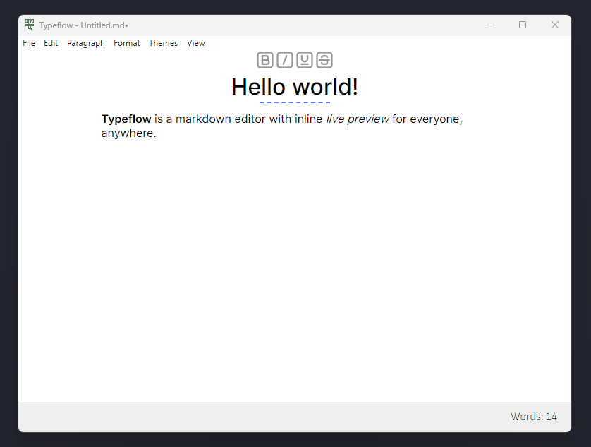

# Typeflow

**Typeflow** is a markdown editor with live preview directly in the editor.  
It is made with modern web technologies such as HTML5, JavaScript and Node.js.

## Features

**NOTE:** This project is in **beta** so a lot of features will be added in the future.

-   Preview your elements inline while you type (headers, codeblocks, etc.)
-   Add your custom themes!
-   View the text you typed in source code mode
-   Modern and simple style
-   And more features to come:)

## Documentation
[Installation](https://github.com/L33dy/typeflow/blob/master/docs/installation.md)

## Buy me a coffee!
You can [buy me](https://buymeacoffee.com/l33dy) a coffee if you liked Typeflow!

## Bugs, feature requests etc.
If you've found a bug or have an idea for a feature, you can navigate to the [Issues](https://github.com/L33dy/typeflow/issues).
